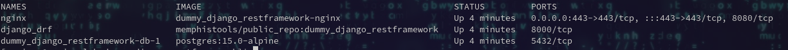
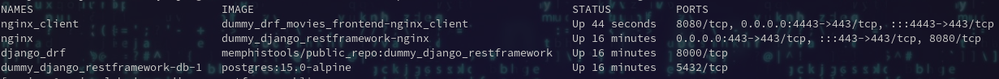
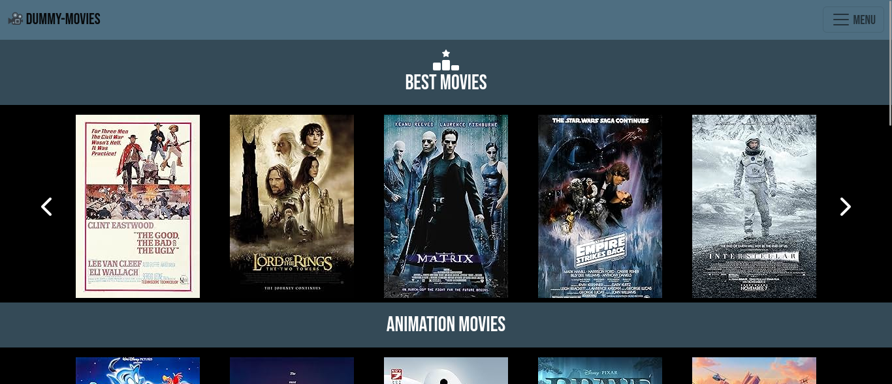

# DUMMY APP FOR LEARNING PURPOSES
This is a dummy client that renders data from a Django REST Framework application. You can find it at: https://github.com/memphis-tools/dummy_django_restframework.

## HOW RUN IT ?

### PREREQUISITES
This dummy client is waiting for a Django REST Framework from the project: https://github.com/memphis-tools/dummy_django_restframework

So be sure you're running this project and services up: docker ps --format "table {{.Names}}\t{{.Image}}\t{{.Status}}\t{{.Ports}}"

Then we clone the repository:
    git clone --recurse-submodules https://github.com/memphis-tools/dummy_drf_movies_frontend.git

    cd dummy_drf_movies_frontend

    git submodule update --remote

At the project root folder, create a "certs" folder and create a dummy self-signed cert:

    mkdir certs

    openssl req -x509 -nodes -days 3650 -newkey rsa:2048 -out ./certs/dummy_imdb_movies.crt -keyout ./certs/dummy_imdb_movies.key -subj "/CN=dummy_imdb_movies"

We use nginx-unprivileged:alpine image. We check the nginx user ids and update the certs owner.

    docker run --rm nginxinc/nginx-unprivileged:alpine id nginx

    chown -R 101:101 certs

### RUN APP
Start the dummy nginx client:
    docker compose up -d

So you should have the following: docker ps --format "table {{.Names}}\t{{.Image}}\t{{.Status}}\t{{.Ports}}"

Go to: https://localhost:4443/

You should find:

